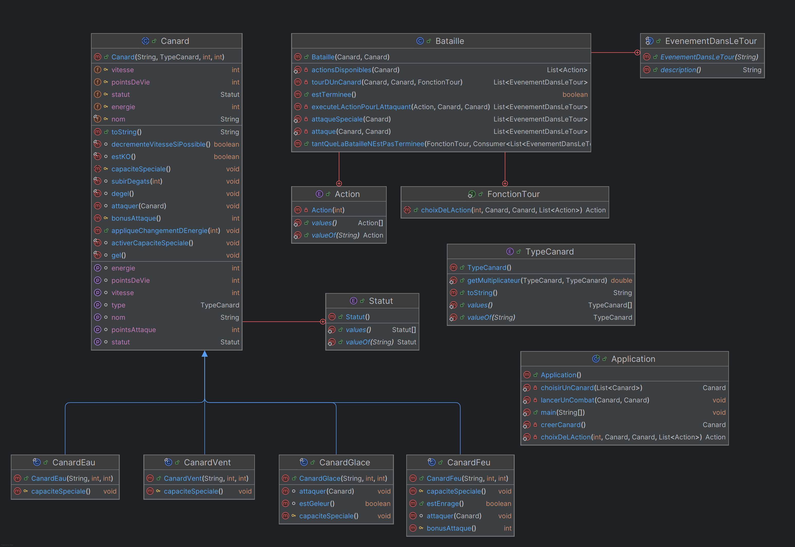

# Canard Fighter Simulator
## Acteurs 
Ce projet a été réalisé par Morgane MICHEL et Jodie MONTERDE dans le cadre de la conception orientée objet. Aucune IA n'a été utilisé pour cette réalisation.
## Description  
Canard Fighter Simulator est un jeu de combat mettant en scène des “Canards Légendaires” disposant de types, forces, faiblesses, attaques et capacités spéciales.
## Questionnements sur la modélisation
*Quelles classes pourraient être abstraites ?*  
La classe Canard est abstraite : on ne souhaite pas directement créer un Canard sans que celui-ci n'est un type définit.  
Par conséquent, c'est une classe qui ne sera jamais instanciée, et c'est uniquement via ses classes filles que nous allons pouvoir créer des Canards.  
On pourrait par ailleurs même aller plus loin et envisager d'en faire une classe scellée (sealed), qui connaîtrait ses classes filles (elle ne permet qu'aux classes qui lui sont spécifiées de l'étendre). Cela donnerait plus de contrôle sur les Canards qui peuvent être créés.    

*Quels comportements communs pourraient être définis dans une interface ?*  
L'attaque spéciale.   

*Comment représenter un changement de statut (par exemple, brûlé ou paralysé) dans la modélisation ?*  
Ici, nous avons choisi de représenter un statut via une énumération. 
Un canard a ainsi forcément un statut : normal, gelé, éventuellement paralysé ou brûlé. De la sorte, on s'assure de limiter le statut d'un Canard à une liste définie et maîtrisée.  
Pour le changer/y accéder, il suffit donc qu'un Canard ait un attribut 'statut' qui contient la valeur de l'énumération qui contient son état actuel.  
À noter : un Canard n'a qu'un seul état en même temps. Plus qu'une limitation, cependant, on peut considérer qu'il s'agit d'un choix
d'implémentation.    

*Quels seraient les avantages d’utiliser une classe ou une interface supplémentaire pour gérer les capacités spéciales ?*  
- s'assurer que tous les Canards implémentent les méthodes qu'ils sont sensés implémenter
- mieux organiser le code 
- éviter la duplication
- pouvoir faire de la spécialisation

*Quels défis sont associés à l’extensibilité de votre modèle pour ajouter de nouveaux types de canards ou de nouvelles capacités ?*  
Continuer à respecter les principes SOLID, notamment : 
- Open/Close : il faut être ouvert à l'extension mais fermé à la modification, ce qui sous entends qu'ajouter de nouveaux canards et capacités ne peut pas avoir un impact sur l'existant.
- substitution de Liskov : Une classe dérivée doit pouvoir être utilisée à la place de sa classe mère sans modifier le comportement attendu. Si un CanardRobot hérite d’une classe Canard et que Canard a une méthode pondreOeuf(), le CanardRobot devra implémenter cette méthode alors qu’il ne pond pas d'œufs. Cela pourrait entraîner des comportements incohérents.
- Ségregation des interfaces : Les classes ne doivent pas être forcées à implémenter des méthodes dont elles n’ont pas besoin. Une interface Canard contenant voler(), cancaner(), et nager() obligerait un CanardEnPlastique à implémenter voler(), même s’il ne vole pas.
## Diagramme UML des classes 

## Description des choix techniques 
* Classe Canard Abstraite : comme expliqué plus haut.
* Enumérations : TypeCanard et Statut : comme expliqué plus haut.
  * Le multiplicateur dans TypeCanard est sous forme de tableau pour faciliter l'accès aux données (solution envisagée dans un premier temps : hashmap, moins efficace).
  * Statut n'est pas dans un fichier séparé : nous considérons qu'il dépend directement de Canard et qu'il n'a pas d'existence sans celui-ci. Nous aurions par ailleurs fait de même pour TypeCanard si le sujet l'avait permis. 
* Classe Application et Bataille :
  * Le choix majeur ici a été de séparer l'implémentation de la Bataille du menu. Ce n'est pas au système de combat d'intégrer les entrées utilisateurs. D'où la classe Bataille. Il faudrait par ailleurs également implémenter une classe 'Menu', car le Main ne devrait contenir que le point d'entrée de l'application, mais par manque de temps, cela n'a pas pu être fait.
## Réalisations bonus 
* Gestion avancée des combats
  * Points d’énergie (PE)
  * Attaques critiques
* Personnalisation et progression
  * Création de canards personnalisés
